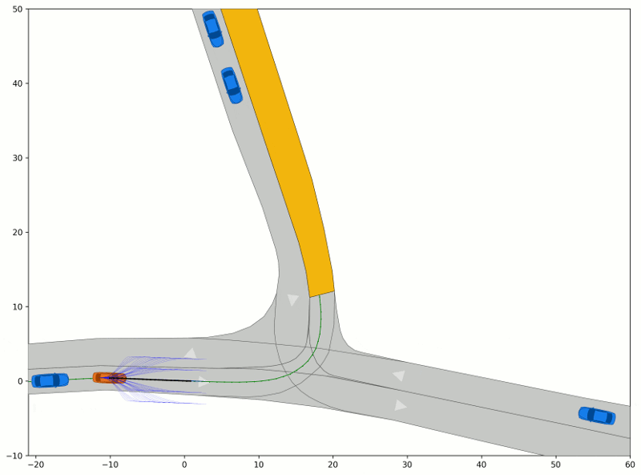

# Reactive Planner

This project generates solutions to trajectory planning problems given in the [CommonRoad](https://commonroad.in.tum.de/) scenario format.
The trajectories are generated using the sampling-based approach in [1][2]. This approach plans motions by sampling a 
discrete set of trajectories, represented as quintic polynomials in a Frenet frame and selecting an optimal trajectory according
to a given cost function.




## Getting Started
These instructions should help you to install the trajectory planner and use it for development and testing purposes.

To install the package from PyPi, please run:
```shell
pip install commonroad-reactive-planner
```

### Requirements
The software is  written in Python 3.8 and tested on Ubuntu 18.04-22.04. The required python dependencies are listed in `pyproject.toml`.

For the python installation, we suggest the usage of [Anaconda](http://www.anaconda.com/download/#download).

For the development IDE we suggest [PyCharm](http://www.jetbrains.com/pycharm/)


### Installation from Source
1. Clone this repository & create a new conda environment, e.g.,  `conda create -n commonroad-py38 python=3.8`


2. Go to cloned root directory and install the package:
    * Install the package via poetry: `poetry install`
    * Install the package via pip: `pip install .`


### How to run

**Main example script** `run_planner.py`: 

The example script shows how to run the planner on an exemplary CommonRoad scenario with the following steps:
* creating a planner configuration
* instantiating the reactive planner
* running the planner in a cyclic replanning loop with a fixed replanning fequency

In addition we also provide an interactive Jupyter notebook tutorial in the `tutorial/` folder.


## Literature
[1] Werling M., et al. *Optimal trajectory generation for dynamic street scenarios in a frenet frame*. In: IEEE International Conference on Robotics and Automation, Anchorage, Alaska, 987–993.

[2] Werling M., et al. *Optimal trajectories for time-critical street scenarios using discretized terminal manifolds* In:
The International Journal of Robotics Research, 2012
