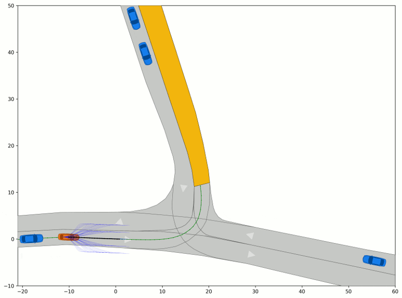

# CommonRoad Reactive Planner
Work in Progress

## Overview
This project generates solutions to trajectory planning problems given in the CommonRoad scenario format. 
The trajectories are generated following the sampling-based approach in [1]. 
This approach plans motions by sampling a discrete set of trajectories, represented as quintic polynomials in 
a curvilinear (Frenét) coordinate frame. The sampled trajectories are checked for kinematic feasibility 
and collision with static/dynamic obstacles before selecting an optimal trajectory according to a given cost function.

## Example

## Authors
Responsible: Gerald Würsching, gerald.wuersching[at]tum.de

## Reference 
[1] Werling, M., et al. "Optimal trajectory generation for dynamic street scenarios in a Frenét frame." Proc. of the IEEE Int. Conf. on Robotics and Automation, 2010, pp. 987-993.

